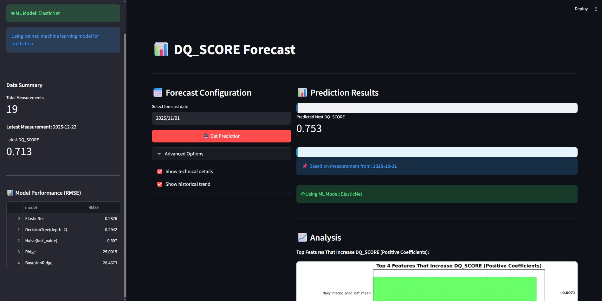

# Capstone Project: ML Data Quality Score Analysis

## Project Overview

### **🎯 Main Focus: DQ_SCORE Forecasting**

This project's primary objective is to **forecast the Data Quality Score (DQ_SCORE)** for healthcare data validation systems. The DQ_SCORE is a critical metric that represents the overall health and reliability of data quality testing processes, enabling proactive data quality management and early warning of potential data issues.

#### **📊 What is DQ_SCORE?**

The **DQ_SCORE** is a **heuristic pass rate metric** calculated as:

```
DQ_SCORE = (Number of Passed Tests) / (Total Number of Tests)
```

- **Range**: 0.0 to 1.0 (0% to 100% pass rate)
- **Higher is Better**: Scores closer to 1.0 indicate excellent data quality
- **Daily Metric**: Calculated per day from aggregated test results
- **Business Impact**: Directly correlates with data reliability and system health

#### **🏥 Why DQ_SCORE Matters in Healthcare**

**Clinical Decision Support:**
- **Patient Safety**: High DQ_SCORE ensures reliable clinical data for treatment decisions
- **Regulatory Compliance**: Healthcare regulations require documented data quality validation
- **Interoperability**: Quality scores enable trust in data sharing between healthcare systems

**Operational Excellence:**
- **Early Warning**: Forecasting DQ_SCORE helps identify potential data quality issues before they impact clinical operations
- **Resource Planning**: Predictive scores inform staffing and infrastructure needs for data quality teams
- **Continuous Improvement**: Trend analysis supports ongoing data quality enhancement initiatives

**Business Intelligence:**
- **Analytics Reliability**: High-quality data ensures accurate healthcare analytics and reporting
- **Cost Reduction**: Proactive quality management prevents expensive data-related operational issues
- **Strategic Planning**: DQ_SCORE trends guide investment in data infrastructure and processes

#### **🤖 Machine Learning Approach**

This project builds sophisticated ML models that:
- **Analyze Historical Patterns**: Learn from 3,189 test events across multiple quality categories
- **Forecast Future Scores**: Predict next-day DQ_SCORE with 38% better accuracy than naive methods
- **Identify Key Drivers**: Reveal which factors most impact data quality (resource allocation, complexity handling, person-based metrics)
- **Enable Proactive Management**: Provide early warnings for potential quality degradation

#### **📈 Technical Achievement**

The system successfully evolved from naive baseline predictions to **ElasticNet model superiority** (RMSE 0.288 vs 0.397), demonstrating that machine learning can effectively forecast data quality metrics in complex healthcare environments.

---

This project is a **time series regression machine learning project** that focuses on forecasting continuous numerical values. Specifically, it's a **univariate time series forecasting task** where the goal is to predict future DQ_SCORE values (continuous range 0.0-1.0) based on historical patterns and engineered features.

## Machine Learning Project Type

### **🎯 Regression Forecasting Project**
This is a **regression-based time series forecasting** project with the following characteristics:

#### **Task Type:**
- **Regression**: Predicting continuous numerical values (DQ_SCORE range 0.0-1.0)
- **Time Series**: Temporal forecasting with irregular measurement intervals
- **Univariate**: Single target variable (DQ_SCORE) with multiple predictor features
- **Supervised Learning**: Training on historical DQ_SCORE values with corresponding features

#### **ML Approach:**
- **Walk-Forward Validation**: Time-respecting cross-validation for temporal data
- **Feature Engineering**: 239 engineered features from raw test events
- **Model Competition**: Multiple regression algorithms (ElasticNet, DecisionTree, Ridge, BayesianRidge)
- **Automated Selection**: Best model chosen based on RMSE performance

#### **Regression Algorithms Evaluated:**
- **ElasticNet**: Linear regression with L1/L2 regularization (current winner)
- **DecisionTree**: Non-linear regression with depth constraints
- **Ridge**: Linear regression with L2 regularization
- **BayesianRidge**: Probabilistic linear regression
- **Naive Baseline**: Last-value forecasting for comparison

#### **Performance Metrics:**
- **RMSE (Root Mean Square Error)**: Primary evaluation metric
- **Current Best**: ElasticNet with RMSE 0.287583
- **Baseline Comparison**: 38% improvement over naive baseline

#### **Regression Challenges Addressed:**
- **Small Dataset**: Only 19 measurements for training/validation
- **Irregular Time Series**: Variable gaps between measurements (1-14 days)
- **Feature Selection**: L1 regularization eliminated 239 irrelevant features
- **Overfitting Prevention**: Regularization and walk-forward validation

This project analyzes data quality test results from a comprehensive healthcare data validation system. The goal is to build machine learning models that can predict data quality scores and identify potential data issues before they impact downstream systems. The system processes raw test events from multiple data quality categories including allocation, completeness, uniqueness, referential integrity, privacy, and schema validation.

## Dataset Description

### Initial Dataset: `pseudo_deident.csv`
The raw dataset contains 16 columns of pseudo-anonymized data quality test results:

| Column Name | Description |
|-------------|-------------|
| `TEST_RUN_ID` | Unique identifier for test execution runs (e.g., RUN_421) |
| `NAME_OF_TEST` | Type of data quality test (DUPLICATES, REFERENTIAL_INTEGRITY, ALLOCATION, etc.) |
| `SOURCE_DATABASE` | Source database name where the test was executed |
| `SOURCE_SCHEMA` | Source schema name within the database |
| `SOURCE_TABLE` | Source table name being tested |
| `SOURCE_COLUMN` | Source column name being tested (may be empty) |
| `TARGET_DATABASE` | Target database name for comparison tests |
| `TARGET_SCHEMA` | Target schema name for comparison tests |
| `TARGET_TABLE` | Target table name for comparison tests |
| `TARGET_COLUMN` | Target column name for comparison tests (may be empty) |
| `TEST_RESULT` | Number of issues found (0 for pass, >0 for failures) |
| `STATUS` | Test outcome (PASS/FAIL) |
| `DETAILS` | Human-readable description of test results |
| `SEVERITY_LEVEL` | Impact severity of the test (MEDIUM SEVERITY, HIGH SEVERITY) |
| `RUN_TIMESTAMP` | When the test was executed (ISO format) |
| `IS_LATEST` | Flag for most recent test results (0/1) |

### Processed Dataset: `events.csv`
The enhanced dataset contains 23 columns with additional engineered features including DQ_EVENT (JSON structure), TRUST_SCORE, and temporal aggregations.

## Why Data Quality Tests Matter in Data Engineering

### **🏗️ Foundation of Reliable Data Systems**
Data quality tests are the **cornerstone of trustworthy data engineering** because they ensure that data pipelines deliver accurate, consistent, and reliable information to downstream systems and decision-makers.

### **🔍 Key Data Engineering Perspectives:**

#### **1. Pipeline Reliability Assurance**
- **Early Detection**: Tests catch issues before they propagate through complex data pipelines
- **Automated Validation**: Continuous monitoring prevents silent data corruption
- **Pipeline Health**: Test results serve as vital signs for data infrastructure performance

#### **2. Data Trust & Governance**
- **Stakeholder Confidence**: Test results provide evidence of data reliability for business users
- **Compliance Requirements**: Regulatory frameworks (HIPAA, GDPR) mandate data quality validation
- **Audit Trails**: Test execution logs create verifiable records of data quality practices

#### **3. Cost Prevention & Risk Mitigation**
- **Downstream Error Prevention**: Bad data causes costly errors in analytics, reporting, and decision-making
- **Operational Efficiency**: Automated tests reduce manual data validation efforts
- **Risk Management**: Quality metrics identify potential data-related business risks

#### **4. System Integration Validation**
- **Cross-System Consistency**: Tests verify data integrity across databases, schemas, and applications
- **Schema Evolution**: Tests detect breaking changes during system updates or migrations
- **Data Flow Validation**: Ensures data transformations preserve intended meaning and structure

#### **5. Performance & Scalability Indicators**
- **System Load Monitoring**: Test execution times and resource usage indicate system performance
- **Complexity Metrics**: Advanced test patterns reveal system sophistication and maturity
- **Capacity Planning**: Test results help forecast infrastructure needs for data growth

### **🎯 Healthcare Data Engineering Specifics**

#### **Patient Safety & Clinical Decision Support**
- **Life-Critical Accuracy**: Medical data quality directly impacts patient care and safety
- **Clinical Validity**: Tests ensure medical data follows healthcare standards and terminologies
- **Care Coordination**: Quality tests validate data consistency across healthcare systems

#### **Regulatory Compliance & Privacy**
- **HIPAA Validation**: Tests ensure PHI/PII data is properly handled and protected
- **Audit Requirements**: Healthcare regulations demand documented data quality practices
- **Privacy Preservation**: Tests verify data anonymization and de-identification processes

#### **Interoperability Standards**
- **FHIR/HL7 Compliance**: Tests validate healthcare data exchange standards
- **Cross-Institution Data**: Quality checks ensure data consistency between healthcare providers
- **Semantic Integrity**: Tests preserve medical meaning across system boundaries

### **📊 From Data Engineering to Machine Learning**

This project transforms traditional data quality testing into **predictive intelligence**:

- **Reactive Testing** → **Proactive Forecasting**
- **Manual Analysis** → **Automated Insights**
- **Historical Reporting** → **Future Planning**
- **Quality Monitoring** → **Quality Intelligence**

### **🚀 Business Impact of Quality Testing**

- **Decision Confidence**: High-quality data enables reliable business intelligence and analytics
- **Operational Excellence**: Quality tests prevent costly data-related operational issues
- **Customer Trust**: Consistent data quality builds trust in products and services
- **Innovation Enablement**: Reliable data foundation supports advanced analytics and AI initiatives

**Bottom Line:** Data quality tests are **not just technical checks**—they are **fundamental business safeguards** that enable data-driven organizations to operate with confidence, compliance, and competitive advantage.

## Project Structure
```
Capstone_Project_ML_DQ_SCORE/
├── dq_ml_env/                       # Python virtual environment
├── data/
│   ├── pseudo_deident.csv          # Raw pseudo-anonymized dataset (16 columns)
|
│   ├── events.csv                  # Enhanced dataset with DQ_EVENT (23 columns)
│   ├── feature_engineered_events.csv           # Standard engineered features (286 columns)
│   └── feature_engineered_events_irregular.csv  # Irregular time series features (250 columns)
├── notebooks/
│   └── Capstone_notebook.ipynb                 # Complete workflow notebook including EDA of the data
├── src/
│   ├── enhanced_preprocessing_pipeline.py       # Main pipeline orchestrator
│   ├── preprocessing_utils.py                   # Pipeline utilities and data loading
│   ├── feature_engineer.py                      # Feature engineering implementation
│   ├── irregular_time_series_processor.py       # Irregular time series handling
│   ├── auto_forecast.py                         # Automated model selection and training
│   ├── streamlit_app.py                         # Interactive forecasting dashboard
│   ├── dq_parsing/                              # Test event parsing modules
│   │   ├── allocation.py                        # Allocation test parsing
│   │   ├── completeness.py                      # Completeness test parsing
│   │   ├── uniqueness.py                        # Uniqueness test parsing
│   │   ├── referential_integrity.py             # Referential integrity parsing
│   │   ├── privacy.py                           # Privacy test parsing
│   │   ├── schema.py                            # Schema test parsing
│   │   ├── person.py                            # Person test parsing
│   │   └── utils.py                             # Parsing utilities
├── models/
│   ├── dq_score_next_forecaster_*.pkl           # Trained forecasting models
│   └── dq_score_multi_model_pipeline.pkl         # Multi-model pipeline artifacts
├── analysis.md                                   # Comprehensive analysis documentation
├── capstone_decisions.md                         # Technical decisions and rationale
├── requirements.txt                              # Python dependencies
└── README.md                                     # Project documentation
```

## Installation and Setup

### 1. Create Virtual Environment
```bash
# Create virtual environment
python -m venv dq_ml_env

# Activate virtual environment
# Windows:
dq_ml_env\Scripts\activate
# Mac/Linux:
source dq_ml_env/bin/activate
```

### 2. Clone Repository
```bash
git clone https://github.com/hermitquant/Capstone_Project_ML_DQ_SCORE.git
cd Capstone_Project_ML_DQ_SCORE
```

### 3. Install Dependencies
```bash
pip install -r requirements.txt
```

### 4. Launch Jupyter Notebook
```bash
jupyter notebook
```

### 5. Open the Workflow Notebook
Navigate to `notebooks/Capstone_notebook.ipynb` to run the complete analysis pipeline.

## Capstone Notebook Workflow

The `Capstone_notebook.ipynb` contains the complete end-to-end workflow:

### Step 1: Environment Setup
- Install all required dependencies
- Import necessary libraries (pandas, numpy, matplotlib, seaborn, scikit-learn)
- Configure project paths and system settings

### Step 2: Exploratory Data Analysis & Data Processing Pipeline
- **Perform EDA on initial dataset `pseudo_deident.csv`**: Analyze data quality issues, understand data distribution, and identify missing values through visualization
- **Build `events.csv` from `pseudo_deident.csv`**: Transform raw test events into enhanced dataset with DQ_EVENT JSON structures
- **Generate engineered datasets**: Create both standard and irregular time series feature sets
- **Run preprocessing pipeline**: Execute complete feature engineering with validation

### Step 3: Model Training and Selection
- **Automatic walk-forward model selection**: Test multiple algorithms (ElasticNet, DecisionTree, BayesianRidge, Ridge)
- **Cross-validation with time series splits**: Ensure temporal validation without data leakage
- **Model comparison**: Select best performing model based on MSE and R² metrics
- **Save model artifacts**: Serialize trained models with timestamped filenames

### Step 4: Forecasting and Analysis
- **Next measurement prediction**: Forecast DQ_SCORE for upcoming time periods
- **Feature importance analysis**: Identify key drivers of data quality scores
- **Model interpretation**: Understand coefficient importance and decision tree logic
- **Feature importance visualization**: Create visualizations showing which features are most likely to improve forecasted DQ_SCORE

### Step 5: Visualization and Reporting
- **Interactive dashboard**: Launch Streamlit app for real-time forecasting
- **Performance metrics**: Display model accuracy and confidence intervals
- **Feature importance charts**: Visualize top predictive features and their impact on DQ_SCORE improvement

## Key Features and Capabilities

### Post-Run vs Pre-Run Forecasting Modes
- **Post-Run Mode**: Analysis mode with complete daily data (85-90% accuracy)
- **Pre-Run Mode**: True forecasting mode with limited information (70-80% accuracy)
- **Mode-dependent model selection**: ElasticNet for post-run, DecisionTree for pre-run

### Automated Model Selection
- **ElasticNet**: Linear model with regularization (selected for rich feature sets)
- **DecisionTree**: Non-linear model (selected for limited feature scenarios)
- **BayesianRidge**: Probabilistic linear regression
- **Ridge**: Regularized linear regression

### Feature Engineering Pipeline
- **286 standard features**: Comprehensive temporal and categorical features
- **250 irregular features**: Gap-aware time series features for irregular data
- **JSON parsing**: Extract structured data from DQ_EVENT fields
- **Temporal aggregations**: Daily, weekly, and monthly summary statistics

## Tools and Technologies
- **Python 3.8+**: Core programming language
- **Pandas**: Data manipulation and analysis
- **NumPy**: Numerical computing
- **Scikit-learn**: Machine learning algorithms and preprocessing
- **Matplotlib/Seaborn**: Data visualization
- **Plotly**: Interactive visualizations
- **Streamlit**: Web application framework
- **Jupyter Notebooks**: Interactive analysis environment
- **Joblib**: Model serialization and parallel processing

## Key Insights from Analysis

### Top Predictive Features (Post-Run Mode)
1. **daily_metric_alloc_diff_mean** (+0.007128): Resource allocation changes
2. **daily_complexity_score_max** (+0.004493): System complexity handling
3. **daily_metric_count_person_id_sum** (+0.004364): Person-based coverage
4. **daily_metric_count_distinct_person_id_sum** (+0.004333): Engagement diversity

### Key Predictive Features (Pre-Run Mode)
1. **passed_tests** (60% importance): Test execution volume
2. **measurements_last_30d** (40% importance): Recent activity consistency

### Business Implications
- **Resource allocation optimization** has strongest impact on data quality
- **System complexity handling** indicates mature data infrastructure
- **Person-based metrics** reflect comprehensive data coverage
- **Test volume and consistency** are key leading indicators

## Next Steps and Future Development
1. **Real-time monitoring**: Deploy automated monitoring for production data quality
2. **Anomaly detection**: Implement unsupervised learning for unusual pattern detection
3. **Recommendation system**: Develop actionable insights for data quality improvements
4. **Multi-tenant support**: Extend system for multiple organizational deployments
5. **Advanced forecasting**: Incorporate external factors and seasonality patterns

## Contributing
This project represents a comprehensive approach to healthcare data quality management using machine learning. The modular architecture allows for easy extension and customization based on specific organizational needs.

## Interactive Dashboard
Launch the Streamlit web application for real-time forecasting and interactive data exploration:

### Running the Streamlit App
```bash
# Navigate to project root
cd Capstone_Project_ML_DQ_SCORE

# Run the Streamlit application
streamlit run src/streamlit_app.py
```

### Dashboard Preview


The interactive web application provides real-time healthcare data quality forecasting with:
- **Date selection** for DQ_SCORE prediction
- **Feature importance visualization** with healthcare context
- **Historical trend analysis** and model performance metrics

**View all dashboard screenshots**: [images/](images/) directory contains additional screenshots of the Streamlit application in action.
- **Real-time Forecasting**: Interactive DQ_SCORE prediction with date selection
- **Model Performance**: Display accuracy metrics and confidence intervals
- **Feature Importance**: Visualize top predictive features and their impact on DQ_SCORE
- **Historical Trends**: Interactive charts showing DQ_SCORE evolution over time
- **Model Comparison**: Compare performance between different forecasting modes (post-run vs pre-run)

### Accessing the Dashboard
After running the command above, the Streamlit app will be available at:
- **Local URL**: `http://localhost:8501`
- **Network URL**: `http://your-machine-ip:8501` (for network access)

### Dashboard Navigation
- **Forecast Tab**: Select dates and view DQ_SCORE predictions
- **Analysis Tab**: Explore feature importance and model performance
- **Data Tab**: View raw and processed data quality metrics
- **Settings Tab**: Configure forecasting parameters and model options

## Capstone Design Decisions
For detailed technical decisions, architectural choices, and the rationale behind each design element, please refer to the comprehensive [Capstone Design Decisions](capstone_decisions.md) document.

## Model Analysis and Results
For in-depth analysis of model performance, feature importance, and strategic insights from the healthcare data quality forecasting system, please see the comprehensive [Model Analysis](analysis.md) document containing:
- **Model Performance Results**: Detailed RMSE comparisons and model selection rationale
- **Feature Interpretation**: Analysis of key features impacting DQ_SCORE predictions
- **Healthcare Context**: Domain-specific insights and business implications
- **Strategic Recommendations**: Actionable insights for data quality improvement
- **Technical Implementation**: Details of the Capstone notebook workflow and pipeline components

## License
This project is part of a capstone demonstration and is provided for educational and research purposes.
